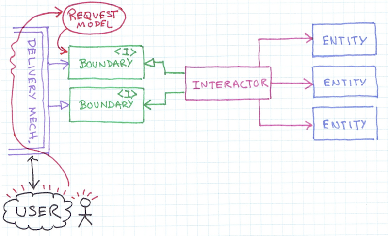
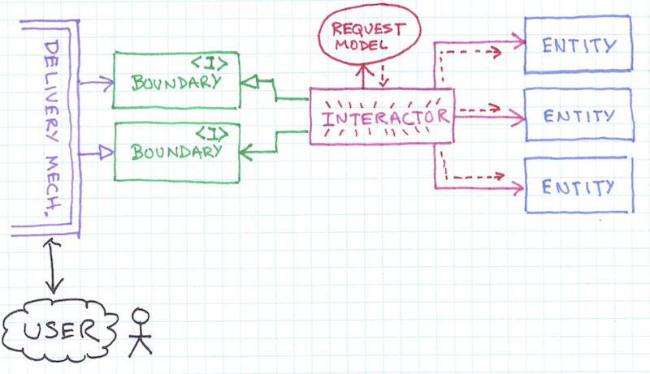
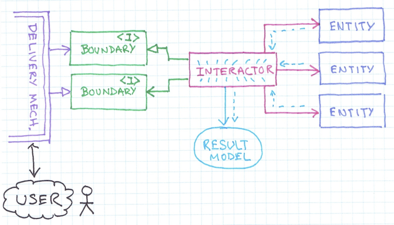
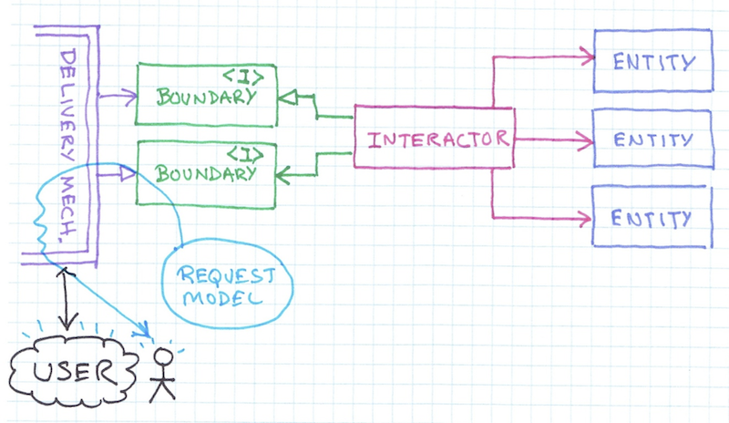

# ridomo-usecase
> Rich Domain Model Support For Uncle Bob's Clean Code Cast Episode 7 Architecture, Use Cases, and High Level Design

## Warning
> Interactor & Presenter are not Thread Safe

1. Intent
	1. 밥 아저씨가 Clean Code Cast 에서 제시한 Use Case 가 드러난 Architecture에 대한 구조를 생각 해 본다.
2. Flow
	1. Delivery Mechanism 으로 부터 Request Model 을 생성하여 Boundary 로 위임
	
	2. Interactor 는 실제 Entity 들과 상호 작용하여 Request Model 데이터를 처리
	
	3. Interactor 처리 결과를 Response Model(Result Model)로 취합한다.
	
	4. Response Model 을 Boundary 를 통해 Delivery Mechanism 으로 보낸다.
	

## Example

### Interactor

```java
public class ListingInteractor extends AbstractInteractor<RequestModel> {
	@Override
	protected void execute(RequestModel request) {
		// Some Interaction(UseCase)
	}
}
...

// use interactor
Interactor<RequestModel> interactor = new ListingInteractor();
interactor.accept(request);
interactor.interact();
...

// composite interactor
Interactor<RequestModel> interactor = new CompositeInteractor<RequestModel>(firstInteractor, secondInteractor);
	...
```

### Presenter

```java
public class ListingPresenter extends AbstractPresenter<ResponseModel> {
	@Override
	protected void execute(ResponseModel response) {
		// Some Presentation
	}
}
...

// composite presenter
Presenter<ResponseModel> presenter = new CompositePresenter<ResponseModel>(firstPresenter, secondPresenter);
...
```

### PresentableInteractor

```java
public class ListingInteractor extends AbstractPresentableInteractor<RequestModel, ResponseModel> {
	@Override
	protected void perform(RequestModel request) {
		// Some Interaction(UseCase)
	}

	@Override
	protected ResponseModel createResponseModel() {
		// return specific Response Model, Used Presenter
	}
}
...
PresentableInteractor<RequestModel, ResponseModel> interactor = new ListingInteractor();
interactor.setPresenter(new ListingPresenter());

interactor.accept(request);
interactor.interact();
...

// composite presentable interactor
PresentableInteractor<RequestModel, ResponseModel> interactor presenter = new CompositePresentableInteractor<RequestModel, ResponseModel>(firstPresentableInteractor, secondPresentableInteractor);
...
```

## 참조
* [High Level Design Model, Characterization](http://www.cleancoders.com/codecast/clean-code-episode-7/show)
* [Command Query Segregation](http://martinfowler.com/bliki/CommandQuerySeparation.html)
* [Command Query Responsibility Segregation](http://martinfowler.com/bliki/CQRS.html)